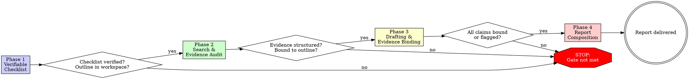
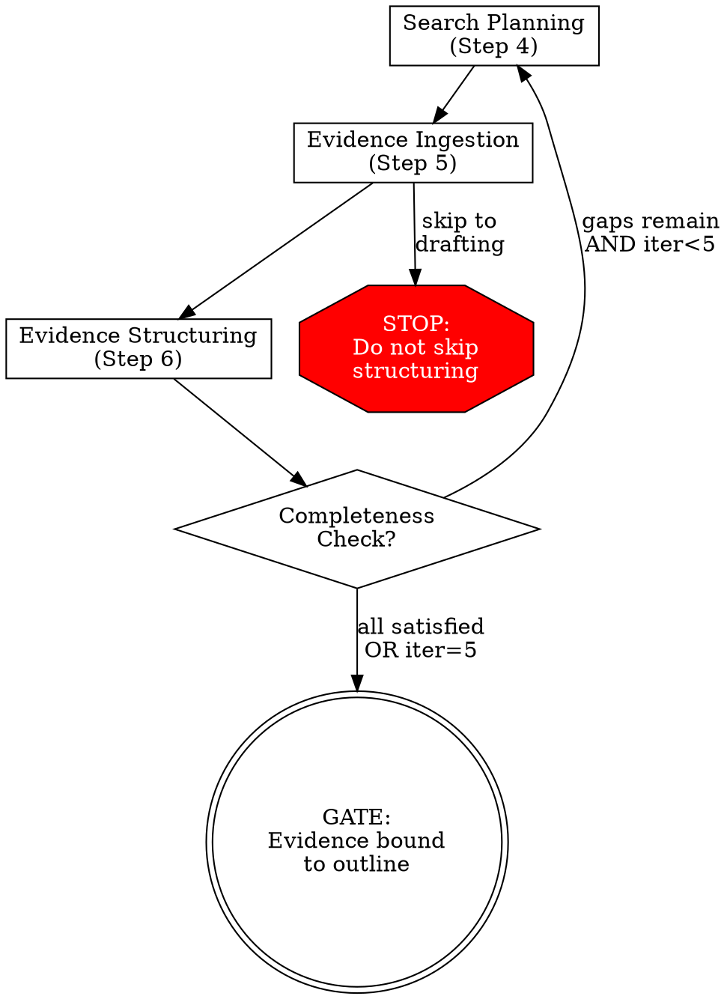

# Deep Research

## Overview

Structured web research producing evidence-backed reports with citations and confidence assessments.

**Core principle:** Every claim in the report must trace to audited web evidence. Training data is not evidence.

**Violating the letter of this process is violating the spirit of research.**

**Announce at start:** "I'm using the deep-research skill to conduct structured, evidence-backed research."

## The Iron Law

```
NO DRAFTING WITHOUT EVIDENCE. NO SEARCH WITHOUT A CHECKLIST.
```

Drafted without evidence? Delete the draft. Searched without a checklist? Stop and write the checklist.

**No exceptions:**

- Not for "simple topics I already know"
- Not for "just getting started, I'll formalize later"
- Not for "the user is waiting"
- Not for "my training data is accurate on this"
- Not for "I have someone else's outline to work from"

## When to Use

**Use for:**

- Comprehensive research requests requiring multiple sources
- Deep investigation of a topic with web evidence
- Multi-source analysis needing citations and confidence levels
- Any request where the user expects a structured report backed by current data

**Do NOT use for:**

- Simple factual questions answerable in one search
- Codebase exploration (use the Explore agent)
- Implementation planning (use superpowers:writing-plans)
- Topics where web sources are irrelevant or unavailable

## Output

- **Report:** `docs/research/YYYY-MM-DD-<topic-slug>-report.md`
- **Workspace:** `docs/research/YYYY-MM-DD-<topic-slug>-workspace.md` (from workspace-template.md in this directory)

## The Four Phases



**You MUST complete each phase and pass its gate before proceeding.** No skipping. No "I'll come back to it."

### Phase 1: Verifiable Checklist Module (VCM)

**Purpose:** Decompose the query into traceable, verifiable sub-goals BEFORE any search begins.

**Step 1 — Checklist Generation:**

1. Decompose research query into 3-8 verifiable sub-goals
2. Each sub-goal requires:
   - **Scope:** What it covers and explicitly excludes
   - **Definitions:** Key terms clarified to prevent ambiguous searches
   - **Acceptance criteria:** How to objectively determine when satisfied (e.g., "at least 2 independent sources confirm X")

**Step 2 — Critic Review** each sub-goal:

- **Ambiguity:** Is scope specific enough for targeted search queries?
- **Completeness:** Missing dimensions? (Consider: technical, economic, social, legal, historical, comparative)
- **Verifiability:** Can acceptance criteria be objectively evaluated?
- Refine any sub-goal that fails

**Step 3 — Hierarchical Outline:**

- Compile verified sub-goals into a report outline
- Each sub-goal maps to a section with sub-sections as needed
- Write checklist AND outline to workspace file

**GATE:** Cannot search until checklist is verified and outline is in the workspace file. Use `TaskCreate` to track Phase 1 status.

### Phase 2: Iterative Search & Evidence Audit Module (EAM)

**Purpose:** Structure search results, deduplicate, and bind evidence to outline nodes BEFORE any drafting begins.

**Step 4 — Search Planning:** For each unsatisfied outline node:

- Generate specific search queries
- Each query states: action thought (why this query, what gap it fills, which node it targets)
- **Independent** sections: multiple `WebSearch` calls in parallel (single batch)
- **Dependent** sections (one informs another): search sequentially

**Step 5 — Evidence Ingestion:** For promising results, `WebFetch` full content. Normalize into evidence units in workspace (see evidence-unit-format.md):

- Source URL, title, publication date
- Key claims (verbatim quotes preferred)
- Confidence signal: primary > secondary > opinion > anonymous
- Outline node binding

**Step 6 — Evidence Structuring** after each search batch:

- **Deduplicate:** Merge overlapping evidence, note agreement
- **Summarize:** Condense verbose sources into concise, cited abstracts
- **Update outline:** Split, merge, or reorder sections based on findings
- **Prune:** Remove low-confidence or irrelevant units

**Step 7 — Completeness Check:**

- Review sub-goals: mark each `satisfied` / `partial` / `unsatisfied`
- If unsatisfied remain AND iteration < 5: return to Step 4 with refined queries
- If all satisfied OR max iterations reached: proceed to Phase 3
- Workspace tracks iteration count (initialize to 0, increment after each Step 4-6 cycle)



**GATE:** Cannot draft until evidence is structured and bound to outline nodes. Use `TaskUpdate` to mark Phase 2 complete.

### Phase 3: Drafting & Evidence Binding

**Purpose:** Compose the report with every claim traceable to audited evidence.

**Step 8 — Draft Sections in Parallel:**

Identify the top-level outline sections from the workspace. Launch one subagent per section in a single message (all Agent tool calls in one response). Each subagent receives this prompt:

```
You are drafting section {N} ("{section_title}") of a research report.

1. Read the workspace at `{workspace_path}`
2. Find outline section {N} and all evidence units whose "Bound to" field
   includes {N} or any {N.x} sub-section
3. Draft the section with inline citations (e.g., [Source: URL])

RULES — no exceptions:
- Every factual claim MUST reference a specific EU-NNN from the workspace
- If no evidence unit supports a claim, mark it [UNSUPPORTED] — not
  "preliminary", not "[awaiting verification]", not "based on industry trends"
- Do NOT draft from your own knowledge. Only use evidence units in the workspace.
- Confidence without evidence is hallucination

Return ONLY the drafted markdown section text. Do not modify the workspace file.
```

Once all subagents return, assemble their sections into the Draft Tracker in the workspace (in outline order), then proceed to Step 9.

**Step 9 — Critic Review** the full draft:

- **Unsupported claims:** Any `[UNSUPPORTED]` flags remaining?
- **Contradictions:** Do sections contradict each other?
- **Missing counter-evidence:** Were dissenting viewpoints actively sought?
- **Source diversity:** Does any section rely on a single source where multiple should exist?
- Revise until the critic is satisfied

**GATE:** Cannot finalize until all claims are bound to evidence or flagged as inference with stated confidence. Use `TaskUpdate` to mark Phase 3 complete.

### Phase 4: Report Composition

**Purpose:** Assemble the final deliverable.

**Step 10 — Assemble Report** with this structure:

1. **Executive Summary** (200-300 words): Key findings, core insights, conclusions with confidence levels
2. **Detailed Analysis**: Section-by-section findings matching outline, with inline citations
3. **Insights & Recommendations**: Practical implications, actionable takeaways
4. **Confidence Assessment:**
   - High confidence findings (>80% certainty)
   - Moderate confidence findings (50-80%)
   - Areas of uncertainty (<50%)
5. **Knowledge Boundaries**: Research limitations, areas requiring further investigation, unanswered questions
6. **Sources**: Full citation list with URLs

**Step 11 — Write & Present:**

- Save report to `docs/research/YYYY-MM-DD-<topic-slug>-report.md`
- Present executive summary to user in conversation

**GATE:** Report file written, summary presented. Use `TaskUpdate` to mark Phase 4 complete.

## State Management

The **workspace file** is authoritative state. At each step, read from and write to the workspace file rather than relying on conversation history.

- Initialize from `workspace-template.md` in this directory
- Track: checklist status, outline, evidence store, iteration progress, search strategy notes
- Update phase status table as gates are passed
- Evidence units follow the format in `evidence-unit-format.md` in this directory

**If context window is getting long:** Re-read the workspace file to reconstruct state. The workspace contains everything needed to continue.

## Tools

| Tool                        | Purpose                                      |
| --------------------------- | -------------------------------------------- |
| `WebSearch`                 | Query the web for sources                    |
| `WebFetch`                  | Retrieve full page content from URLs         |
| `Write` / `Edit`            | Maintain workspace file and write report     |
| `Read`                      | Read workspace state between iterations      |
| `TaskCreate` / `TaskUpdate` | Track phase progress with one task per phase |

## Quick Reference

| Phase                      | Key Activities                               | Gate to Next Phase                       |
| -------------------------- | -------------------------------------------- | ---------------------------------------- |
| 1. Verifiable Checklist    | Decompose -> Critic -> Outline               | Sub-goals verified, outline in workspace |
| 2. Search & Evidence Audit | Search -> Ingest -> Structure -> Check       | Evidence structured and bound to outline |
| 3. Drafting & Binding      | Draft per section -> Bind evidence -> Critic | All claims bound or flagged as inference |
| 4. Report Composition      | Assemble -> Write -> Present                 | Report file written, summary presented   |

## Red Flags — STOP and Follow the Process

If you catch yourself thinking:

- "I already know enough about this topic" — Your training data is not evidence. Search anyway.
- "Let me just draft this section from what I know" — Check evidence binding first. No evidence, no draft.
- "This search didn't return good results, I'll skip this sub-goal" — Try different queries. Reformulate.
- "The user is waiting, let me just produce something" — Quality requires the full process. Rushing produces hallucination.
- "This is a simple topic, I don't need the full process" — If the skill was triggered, the process is needed.
- "I'll add citations later" — Evidence must be bound DURING drafting, not after.
- "One good source is enough for this section" — Multiple sources strengthen claims and catch bias.
- "The checklist just formalizes what I already know" — Formalization catches gaps intuition misses.
- "I can deduplicate mentally while drafting" — You can't. Unstructured evidence produces unstructured reports.
- "The structuring step is just housekeeping" — Structuring IS the audit. Skipping it means unaudited evidence.
- "A quick disclaimer covers the training data issue" — Disclaimers don't create evidence. Search or flag as unsupported.
- "I can adopt an existing outline and just add acceptance criteria" — You must decompose independently. The critic review catches what the existing outline missed. Acceptance criteria on someone else's decomposition is not Phase 1.
- "Tagging unsourced content as [awaiting verification] is honest and transparent" — A label is not a source. Tagged speculation is still speculation delivered as research. Search or mark as `[UNSUPPORTED]`.
- "Skipping the outline update is an acceptable cut under time pressure" — The outline update is where structural gaps surface before you're committed to them in prose. Skip it and the gaps become the report.
- "The last search iteration is the wrong tool when time is tight" — Time pressure is exactly when the final iteration matters most. It's your last chance to close gaps before drafting.

**All of these mean: STOP. Return to the current phase and complete it properly.**

## Common Rationalizations

| Excuse                                                  | Reality                                                                          |
| ------------------------------------------------------- | -------------------------------------------------------------------------------- |
| "I'm confident about this claim"                        | Confidence without evidence is hallucination                                     |
| "The outline is good enough"                            | The critic review catches gaps you can't see                                     |
| "This sub-goal is obvious"                              | Obvious sub-goals still need acceptance criteria                                 |
| "The evidence clearly supports this"                    | Does it? Or are you pattern-matching from training data?                         |
| "Counter-evidence isn't relevant here"                  | Omitting counter-evidence is bias, not efficiency                                |
| "My training data is accurate on this"                  | Training data is stale, unverifiable, and conflates sources. Search.             |
| "Transparency solves the evidence problem"              | A disclaimer is not a source. Evidence-bind or flag as inference.                |
| "I'll formalize the checklist later"                    | Later never comes. The checklist prevents wasted searches.                       |
| "The 80/20 rule applies to structuring"                 | The 20% you skip is where duplicates and low-confidence sources hide.            |
| "I can always reorganize findings afterward"            | Post-hoc organization misses what a structured approach discovers.               |
| "I can reflect outline changes in the draft itself"     | Drafting and outlining use different modes. One cannot substitute for the other. |
| "I adopted their outline — I just added criteria to it" | Phase 1 requires your decomposition and your critic review. Not theirs.          |

## What This Skill Does NOT Do

- Does not explore codebases (use the Explore agent)
- Does not build implementation plans (use superpowers:writing-plans)
- Does not replace simple factual questions answerable in one search
